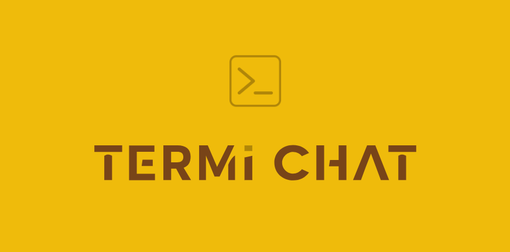

# Termichat
---

## What is Termichat?
Termichat is a simple chat application that runs in the terminal. It uses the OpenAI GPT-3.5-Turbo model to generate responses to messages. Its really a handy tool for developers who want answers to their questions without having to leave the terminal.



### Tech Stack
 &nbsp;
 &nbsp;
 &nbsp;
 &nbsp;

### Installation and Usage
1. Clone the repository
```bash
git clone https://github.com/Lakshit-Chiranjiv/termichat.git

cd termichat
```

2. Install the dependencies
```bash
npm install
```

3. Create a .env file and add your OpenAI API key
```bash
touch .env
```
```env
OPENAI_API_KEY=YOUR_API_KEY
```

4. Run the application
```bash
npm start
```

### Contributing

Contributions and suggestions are welcome! Please fork the repository and create a pull request.

## Thank you for visiting! 😄🔥